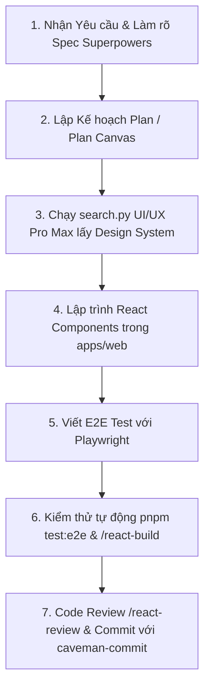

# WEAV — Frontend Development & Agent Skills Guide

Tài liệu này hướng dẫn các thành viên làm **Frontend (`apps/web`)** trong dự án **WEAV** khai thác và sử dụng hiệu quả hệ thống **Agent Skills, Quy trình thiết kế UI/UX, Tối ưu Token và Kiểm thử E2E** đã được tích hợp trong dự án.

---

## 🛠️ Tổng quan Công cụ & Skills đã tích hợp

| Bộ công cụ / Skill | Vị trí / Thư mục | Mục đích sử dụng |
| :--- | :--- | :--- |
| **Superpowers** | Gemini Extension CLI | Quy trình phát triển phần mềm chuẩn kỹ sư (Spec ➔ TDD ➔ Debug ➔ Review) |
| **UI/UX Pro Max** | `.agents/skills/ui-ux-pro-max` | Gợi ý Design System, bảng màu, font chữ, layout và kiểm tra chuẩn UI/UX |
| **Playwright E2E** | `apps/web/e2e`, `playwright.config.ts` | Kiểm thử tự động hóa luồng người dùng trên giao diện Web |
| **Caveman Suite** | `.agents/skills/caveman*` | Tiết kiệm token, hội thoại súc tích, phân tích chi phí AI |
| **ECC Workflows** | `.agents/workflows/` | Các lệnh Slash hỗ trợ lập trình React, build fix và code review |

---

## 🎨 1. Hướng dẫn thiết kế UI/UX với `UI/UX Pro Max`

Khi nhận nhiệm vụ thiết kế hoặc xây dựng màn hình mới (ví dụ: Landing page, Workflow Builder, Dashboard giám sát, Login, v.v.), hãy sử dụng **Design System Generator** trước khi viết code.

### 1.1 Khởi tạo Design System cho tính năng mới

Chạy lệnh tra cứu từ Terminal:

```powershell
python .agents/skills/ui-ux-pro-max/scripts/search.py "<loại_sản_phẩm> <từ_khóa_phong_cách> <ngành>" --design-system -p "<Tên_Trang>"
```

**Ví dụ:**
- **Màn hình Workflow Builder (Sơ đồ quy trình):**
  ```powershell
  python .agents/skills/ui-ux-pro-max/scripts/search.py "workflow automation graph canvas node dark mode" --design-system -p "Workflow Builder"
  ```
- **Dashboard Giám sát Quy trình:**
  ```powershell
  python .agents/skills/ui-ux-pro-max/scripts/search.py "monitoring dashboard real-time analytics" --design-system -p "Process Dashboard"
  ```

### 1.2 Tra cứu nâng cao theo tên miền (`--domain`)

- **Bảng màu (Color Palettes):**
  ```powershell
  python .agents/skills/ui-ux-pro-max/scripts/search.py "saas automation" --domain color
  ```
- **Cặp Font chữ (Typography):**
  ```powershell
  python .agents/skills/ui-ux-pro-max/scripts/search.py "modern tech clean" --domain typography
  ```
- **Biểu đồ & Đồ thị (Charts):**
  ```powershell
  python .agents/skills/ui-ux-pro-max/scripts/search.py "real-time metric chart" --domain chart
  ```

### 1.3 Quy tắc UI Frontend bắt buộc (Pre-Delivery Checklist)
- ❌ **KHÔNG** dùng emoji làm icon UI (vd: 🎨 🚀 ⚙️). **Bắt buộc** dùng SVG icon (`lucide-react` hoặc `heroicons`).
- ✅ **Bắt buộc** thêm class `cursor-pointer` cho mọi element có thể click được.
- ✅ Hover states phải mượt mà (`transition-colors duration-200`), không làm thay đổi kích thước khung (layout shift).
- ✅ Đảm bảo tương phản màu chữ (Light mode: chữ Slate-900 `#0F172A`, không dùng xám nhạt cho văn bản chính).

---

## 🧪 2. Kiểm thử tự động hóa Giao diện với Playwright

Tất cả các tính năng Frontend sau khi làm xong cần có bài kiểm thử E2E để đảm bảo giao diện hoạt động chính xác với Backend.

### 2.1 Cấu trúc thư mục Test
- File cấu hình: [apps/web/playwright.config.ts](file:///d:/End/Weav/apps/web/playwright.config.ts)
- Thư mục chứa bài test: `apps/web/e2e/`

### 2.2 Các lệnh chạy Kiểm thử

| Thao tác | Lệnh thực hiện |
| :--- | :--- |
| **Chạy tất cả E2E tests** | `pnpm --dir apps/web test:e2e` |
| **Chạy giao diện đồ họa (UI Mode)** | `pnpm --dir apps/web exec playwright test --ui` |
| **Xem báo cáo trực quan (HTML Report)** | `pnpm --dir apps/web exec playwright show-report` |
| **Tự động sinh code test (Codegen)** | `pnpm --dir apps/web exec playwright codegen http://localhost:5173` |

### 2.3 Viết một bài E2E Test mẫu (`apps/web/e2e/workflow.spec.ts`)
```typescript
import { test, expect } from '@playwright/test';

test('người dùng có thể mở trang danh sách workflow', async ({ page }) => {
  await page.goto('/workflows');
  await expect(page.getByRole('heading', { name: /workflows/i })).toBeVisible();
});
```

---

## ⚡ 3. Tối ưu Token & Phân tích Chi phí với Caveman

Dự án đã tích hợp công cụ **Caveman** giúp Agent hỗ trợ viết code Frontend cực nhanh và tiết kiệm token.

### 3.1 Các kỹ năng Caveman có thể gọi trong Chat:
- **`caveman`**: Yêu cầu Agent giải thích ngắn gọn, súc tích (đi thẳng vào vấn đề, không dông dài).
- **`caveman-review`**: Review nhanh diff code Frontend (chỉ ra đúng vị trí lỗi & cách sửa 1 dòng).
- **`caveman-explore`**: Tìm kiếm cấu trúc file/component trong dự án tiết kiệm context.
- **`caveman-commit`**: Tạo commit message ngắn gọn chuẩn Conventional Commits.

### 3.2 Lệnh phân tích mức tiêu thụ Token:
Quét lịch sử hội thoại và xem báo cáo tối ưu chi phí:
```powershell
caveman learn
```

---

## 🚀 4. Các lệnh Slash (/ Commands) Hỗ trợ Lập trình React

Bạn có thể khuyến nghị hoặc gõ trực tiếp các lệnh slash này khi làm việc với AI Agent:

- **`/react-build`**: Tự động phát hiện và sửa các lỗi biên dịch React, JSX/TSX, Vite build errors.
- **`/react-review`**: Review mã nguồn React/TSX về hiệu năng (re-render, useMemo, useCallback, hook boundaries).
- **`/react-test`**: Thực thi quy trình TDD cho React Component.
- **`/quality-gate`**: Kiểm tra định dạng và chất lượng code trước khi commit.

## ⚡ 5. Quy trình phát triển Kỹ sư với Superpowers & Planning Mode

**Superpowers** (`obra/superpowers`) và hệ thống **Planning Mode** giúp chuyển đổi AI từ "học việc gõ code" thành "kỹ sư phát triển phần mềm chuẩn mực":

### 5.1 Nguyên tắc 5 bước của Superpowers:
1. **Clarify Specs (Làm rõ Yêu cầu)**: Phân tích kỹ giao diện và dữ liệu đầu vào/đầu ra trước khi viết code.
2. **Design & Planning (Lập Kế hoạch)**: Luôn có bản kế hoạch chi tiết (`implementation_plan.md`) trước khi thực hiện các thay đổi phức tạp.
3. **Test-Driven Development (TDD)**: Viết test (Playwright E2E hoặc Vitest) trước hoặc song song với code giao diện.
4. **Systematic Debugging (Sửa lỗi có hệ thống)**: Đọc log lỗi đầy đủ, không sửa bừa hoặc dùng fallback ẩn lỗi.
5. **Verification & Review**: Chạy kiểm thử tự động xác nhận tính chính xác trước khi báo hoàn thành.

### 5.2 Lệnh quản lý Superpowers cho Gemini CLI:
- Cập nhật extension: `gemini extensions update superpowers`

---

## 🔄 6. Quy trình làm việc đề xuất tổng thể cho Frontend Developer



---

## 🌐 7. Ranh giới Tích hợp OCR Frontend (OCR FE Boundary)

Khi phát triển hoặc tích hợp các tính năng liên quan đến OCR trên giao diện Web (`apps/web`), cần tuân thủ nghiêm ngặt các ranh giới kiến trúc sau:

- **Endpoint & Định tuyến Gateway**: Frontend giao tiếp qua API Gateway bằng biến môi trường `VITE_API_GATEWAY_URL` hoặc route Gateway cùng origin (`same-origin`).
- **Inspector Upload**: Luồng trích xuất tài liệu từ Workflow Builder Inspector gửi request `multipart/form-data` tới:
  ```http
  POST /api/v1/workspaces/{workspaceId}/ocr/extractions
  ```
- **Không gọi trực tiếp Private OCR / Neon từ Browser**: Browser tuyệt đối không kết nối trực tiếp đến Neon Database và không gọi thẳng vào private OCR ingress/service. Toàn bộ lưu lượng bắt buộc phải đi qua API Gateway có xác thực và phân quyền workspace.
- **Workflow Artifact Execution là Server-side**: Việc thực thi quy trình workflow với các tệp dữ liệu được xử lý hoàn toàn ở phía server-side (thông qua `artifactId` hoặc approved file URL). Giao diện người dùng không đóng vai trò xử lý nhị phân hay lưu trữ dữ liệu trung gian cho workflow runtime.
- **Bảo mật & Cấu hình**: Tuyệt đối không khai báo hay đưa các thông tin nhạy cảm, secret, token chứng thực hoặc các giá trị `.env` cụ thể vào mã nguồn hay tài liệu.
